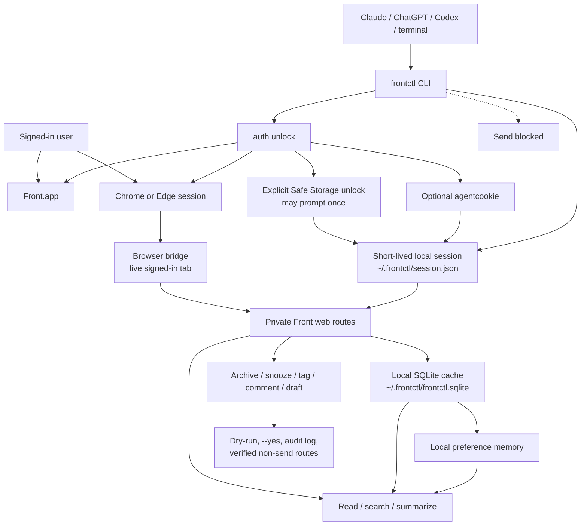

# frontctl

`frontctl` is a local CLI for managing Front mail from the signed-in desktop app or browser session.

It exists because Front's public API is mainly useful for team inbox automation. It does not give a
normal local user the same kind of control over a personal Front inbox that they expect from Gmail,
Apple Mail, or a browser. `frontctl` fills that gap without using the public Front API.

**What it can do**

- Read, search, summarize, and triage Front conversations.
- Archive, unarchive, snooze, unsnooze, tag, and comment on threads.
- Draft replies and discard drafts.
- Learn local triage preferences from recent Front usage.
- Install Codex and Claude skills, plus ChatGPT-ready instructions.

**What it will not do**

- It does not send email.
- It does not print cookies, auth headers, mailbox bodies in diagnostics, or signed attachment URLs.
- It does not use the public Front API.

## Install

For non-technical users, ship the macOS DMG:

1. Open `frontctl-<version>.dmg`.
2. Run `Install Frontctl for This User.command`.
3. Open `Frontctl Setup.app`.
4. Click `Check Setup`, `Install Agent Skills`, then `Unlock Live Session`.

This default path installs into the user's home directory and does not need an administrator
password. The `.pkg` is still included for managed or system-wide installs.

For local development:

```bash
npm install
npm run build
npm link
frontctl doctor --json
frontctl readiness --json
```

For npm users after publication:

```bash
npm install -g frontctl
frontctl setup --agent all --yes --json
```

## Daily Use

Start with live read-only commands after setup:

```bash
frontctl inbox list --json
frontctl triage inbox --json
frontctl search "customer name" --json
frontctl read CONVERSATION_ID --format markdown
frontctl summarize CONVERSATION_ID --format plain
```

For normal use, read from the live private session. If live reads are locked and browser cookies are
available, approve one unlock that lasts up to 30 days:

```bash
frontctl auth unlock --source default-browser --ttl-hours 720 --json
```

That explicit command may ask macOS Keychain once because Chromium and Electron encrypt cookie
secrets behind Safe Storage. After that, normal reads reuse `~/.frontctl/session.json` and do not
touch Keychain. Repeated Keychain prompts during normal reads are a bug.

The CDP browser bridge is an optional developer/debug path when a browser is launched with remote
debugging:

```bash
frontctl setup --enable-live --json
frontctl bridge status --json
frontctl discovery launch --remote-debugging-port 9222 --json
```

Apple Events are a fallback/debug path, not normal onboarding.

Stale Front HTTP cache reads are never used for normal inbox state. They are available only for
explicit diagnostics or offline recovery with `--offline-cache`, or through `frontctl cache ...` when
the user asks for historical/local-index analysis.

Preview state-changing actions first:

```bash
frontctl archive CONVERSATION_ID --reason "Low-priority thread" --json
frontctl snooze CONVERSATION_ID tomorrow-9am --json
frontctl tag add CONVERSATION_ID TAG_ID_OR_NAME --json
frontctl comment add CONVERSATION_ID --body "Internal note" --json
frontctl draft reply CONVERSATION_ID --body-file reply.md --json
```

Execute only after review:

```bash
frontctl archive CONVERSATION_ID --reason "User approved" --yes --json
```

When a state-changing command executes, frontctl writes a visible agent identity comment first and
then applies the requested action last. Agents should pass `--actor NAME` and `--reason "..."`; they
do not need to manually add a separate identity comment. If the identity comment cannot be written,
the mutation does not run. If the final action fails after the comment is written, the error includes
the Front comment UID/activity ID so the user can inspect the visible trail and decide what to do.

`frontctl send` is always blocked.

## For Agents

Install local skills:

```bash
frontctl agents install --agent codex --yes --json
frontctl agents install --agent claude --yes --json
frontctl agents prompt --agent chatgpt --json
```

Agents should:

- Prefer read-only commands until the user approves a write.
- Pass `--actor` and `--reason` for any state-changing preview or execution.
- Let frontctl add the required visible identity comment before executable state changes.
- Never send email.

## How It Works



`frontctl` discovers the same private web routes used by the signed-in Front app or browser. For
write operations, it only enables routes that have been verified as non-send actions.

## Browser Verification

When a route changes or needs proof, use a logged-in Chrome or Edge tab:

```bash
frontctl discovery browser-status --remote-debugging-port 9222 --json
frontctl discovery browser-probe CONVERSATION_ID --remote-debugging-port 9222 --target-url-contains conversations/CONVERSATION_ID --json
frontctl discovery verify-browser-writes CONVERSATION_ID --remote-debugging-port 9222 --target-url-contains conversations/CONVERSATION_ID --tag-id TAG_ID --yes --json
```

If the CLI has a valid session but the browser tab is not authenticated:

```bash
frontctl discovery browser-seed --remote-debugging-port 9222 --target-url-contains conversations/CONVERSATION_ID --yes --json
```

This copies the reusable `frontctl` session into the selected browser tab through CDP without
printing cookie values or touching Keychain.

## Build And Release

Normal checks:

```bash
npm test
```

Local package and DMG validation:

```bash
npm run check:package:local
```

That command runs tests, builds the setup app, builds the `.pkg` and `.dmg`, expands the package,
mounts the DMG, verifies the packaged CLI runs, and checks manifest hashes.

Optional pre-push hook:

```bash
npm run hooks:install
```

The hook runs `npm test` before push. It intentionally does not build the package or DMG on every
commit.

## More Docs

- [Implementation plan](docs/implementation-plan.md)
- [Onboarding](docs/onboarding.md)
- [Distribution](docs/distribution.md)
- [Product and packaging](docs/product-packaging.md)
- [Release checklist](docs/release-checklist.md)
- [Signing and notarization](docs/signing-notarization-setup.md)
