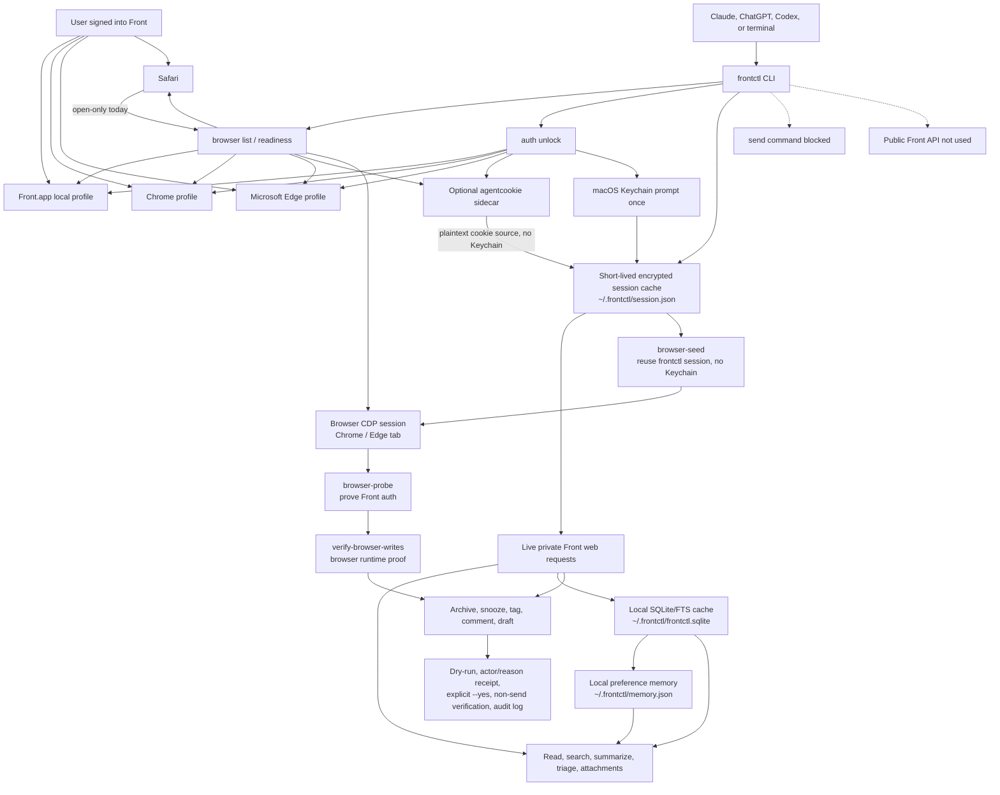

# frontctl

Local-session CLI for controlling Front desktop mail without the public Front API.

This project is intentionally scoped around the authenticated local Front app profile. The current
milestone supports diagnostics, cached and live inbox listing, conversation reads, search,
summaries, sanitized attachment metadata, local SQLite/FTS cache search, draft inspection,
approved archive/snooze/tag/comment/draft actions, sanitized endpoint discovery, and audit review.
Sending email is blocked.

## Motivation

Front is an excellent shared-inbox product, but its public API is shaped around workspace and team
inbox automation. That leaves a frustrating gap for people who do a lot of real work from a personal
Front inbox: the official API cannot simply act like a local mail client for that signed-in user.

The result is that agents and scripts can often manage Gmail, local mail stores, or browser sessions
more directly than they can manage Front, even when the Front desktop app is already open and fully
authenticated on the user's Mac. For personal inbox workflows, that feels backwards. The data and
permissions are present locally, but the API boundary prevents useful everyday automation such as:

- listing and triaging personal inbox conversations
- reading and summarizing threads
- archiving or snoozing messages
- applying tags and adding internal comments
- drafting replies without sending them
- searching recent mail without copying private payloads into an external service

`frontctl` exists to close that local-user gap. It treats the signed-in Front desktop app as the
source of authority, uses the user's existing local session, and avoids the public Front API
entirely. The goal is to make Front manageable from Claude, ChatGPT, Codex, or a normal terminal in
the same way users expect from other mail clients: local, scriptable, personal-inbox aware, and safe
by default.

The safety boundary is deliberate. `frontctl` can inspect, summarize, organize, comment, tag, snooze,
and draft, but it must not send email. Outbound sending should remain a human-controlled action until
the review and approval model is much more mature.

## How It Works



Current local install from this repo:

```bash
npm install
npm run build
npm run test:readonly
npm link
frontctl doctor --json
frontctl inbox list --json
```

Non-technical macOS install path:

1. Open `frontctl-<version>.dmg`.
2. Run `frontctl-<version>.pkg`.
3. Open `Frontctl Setup.app` from the DMG.
4. Click `Check Setup`, then `Install Agent Skills`, then `Enable Live Mode`.
5. Copy the short agent prompt into Claude/Codex, or copy ChatGPT instructions from the setup app.

Verify the CLI after installation:

```bash
frontctl --version
frontctl version --json
frontctl doctor --json
frontctl readiness --json
```

Build local macOS distribution artifacts:

```bash
npm run build:setup-app
npm run build:package
npm run release:check:local
```

One-command local package validation:

```bash
npm run check:package:local
```

For normal development, install the optional pre-push hook instead of a mandatory pre-commit build:

```bash
npm run hooks:install
```

The hook runs `npm test` before push. It intentionally does not build the `.pkg`/`.dmg` on every
commit; run `npm run check:package:local` before release or packaging changes.

Build and publish an unsigned GitHub prerelease for early testers:

```bash
npm run release:verify:local
# or run the GitHub Actions "Preview Release" workflow with a preview tag
```

Generate a Homebrew cask from the built DMG manifest:

```bash
FRONTCTL_DOWNLOAD_BASE_URL=https://example.com/frontctl/v0.1.0 npm run release:homebrew-cask
```

After the package is published to npm, the developer install path is:

```bash
npm install -g frontctl
frontctl --version
frontctl doctor --json
frontctl setup --agent all --yes --json
```

Without `npm link` during development, run commands through Node:

```bash
node dist/src/cli.js inbox list --json
```

Agent skill install:

```bash
frontctl setup --agent all --yes --json
frontctl agents check --json
frontctl agents install --agent codex --yes --json
frontctl agents install --agent claude --yes --json
frontctl agents prompt --agent chatgpt --json
```

Without `--yes`, `frontctl setup --install-agents` and `frontctl agents install` are dry runs that
print the source and destination path without copying anything. Use `--agent all` to install both
local skills.
ChatGPT does not have the same local skill directory as Codex/Claude; use
`frontctl agents prompt --agent chatgpt --json` and paste the instructions into a ChatGPT session
that has local terminal or Codex-style command execution access.

Support and uninstall:

```bash
frontctl diagnose --output frontctl-support.json --json
frontctl uninstall --json
frontctl uninstall --yes --json
```

`diagnose` writes a redacted support bundle with setup status, route verification, storage
metadata, and the same `userReadiness` gate summary returned by `frontctl setup --json`. It does not
include cookie values, auth headers, mailbox bodies, email subjects, or signed attachment URLs.
`uninstall` is a dry run unless `--yes` is present.
For a short non-prompting readiness check, use `frontctl readiness --json`; it reports setup gates
and one next action without reading mailbox contents or Keychain.

Useful read-only commands:

```bash
frontctl inbox list --limit 20 --json
frontctl inbox list --all --limit 50 --json
frontctl triage inbox --limit 20 --json
frontctl search "ResiDesk" --json
frontctl read CONVERSATION_ID --json
frontctl read CONVERSATION_ID --format markdown
frontctl summarize CONVERSATION_ID --format plain
```

Live private-session commands:

```bash
frontctl auth unlock --ttl-hours 12 --json
frontctl auth unlock --source default-browser --ttl-hours 12 --json
frontctl auth unlock --source edge --profile Default --ttl-hours 12 --json
frontctl auth check --json
frontctl auth security --json
frontctl browser list --json
frontctl whoami --json
frontctl inbox list --live --limit 20 --json
frontctl triage inbox --live --limit 20 --json
frontctl search "ResiDesk" --live --json
frontctl read CONVERSATION_ID --live --json
frontctl summarize CONVERSATION_ID --live --json
frontctl attachments list CONVERSATION_ID --live --json
frontctl open CONVERSATION_ID --print-only --json
frontctl open CONVERSATION_ID --web --print-only --json
```

`auth unlock` is the only command that should touch macOS Keychain. It may ask for Touch ID or the
account password once to read the selected local app or browser safe-storage item, then writes a
short-lived encrypted session cache at `~/.frontctl/session.json` with `0600` permissions so normal
commands do not repeatedly trigger Keychain prompts. Supported unlock sources are `front-app`,
`chrome`, `edge`, `default-browser`, and optional `agentcookie`. `auth security --json` reports this
prompt model for agents and support tooling.
If that cache is still valid, rerunning `auth unlock` reuses it without touching Keychain; pass
`--force` only when you intentionally want to refresh the Front cookies.

Browser session commands:

```bash
frontctl browser list --json
frontctl browser inspect --browser edge --json
frontctl browser inspect --browser chrome --json
frontctl auth unlock --source default-browser --ttl-hours 12 --json
frontctl auth unlock --source agentcookie --ttl-hours 12 --json
```

`default-browser` auto-detects the macOS HTTPS handler and supports Chrome or Microsoft Edge cookie
profiles. Safari is currently open-only unless `agentcookie` or a future signed helper provides the
Front cookies. Optional `agentcookie` support is declared in `agentcookie.toml`.

Local index commands:

```bash
frontctl sync --live --limit 100 --json
frontctl cache stats --json
frontctl cache stats --max-age-hours 6 --json
frontctl cache search "ResiDesk" --limit 10 --json
frontctl cache read CONVERSATION_ID --json
frontctl cache read CONVERSATION_ID --format markdown
```

The local index lives at `~/.frontctl/frontctl.sqlite` by default. It contains normalized mailbox
metadata, sanitized attachment metadata, and bounded timeline text for search/read; it does not
store cookies or auth headers. Timeline text is preserved up to 20,000 characters per item and
marks clipped items with `textTruncated` plus `textLength`.
Cache stats/search/read include `freshness` metadata. By default, index results are considered
fresh for 12 hours; override with `--max-age-hours N` or `FRONTCTL_STORE_MAX_AGE_HOURS`.
For agent-readable output, `inbox list`, `search`, `read`, and `summarize` support
`--format markdown` and `--format plain`.

Optional Markdown querying with [`mq`](https://github.com/harehare/mq):

```bash
frontctl mq check --json
frontctl mq install --print-only --json
frontctl read CONVERSATION_ID --format markdown > conversation.md
frontctl mq query --query '.h' --input conversation.md --output-format text
```

`mq` is optional. `frontctl mq install --yes --json` installs it with Homebrew; without `--yes`,
the installer only prints the command.

`frontctl open CONVERSATION_ID` opens a Front deeplink with macOS `open`. Use `--web` to open the
Front web URL instead, and `--print-only` to inspect targets without launching anything.

Memory and preference learning:

```bash
frontctl sync --live --all --limit 200 --json
frontctl memory init --limit 500 --json
frontctl memory report --json
frontctl memory report --fresh --json
frontctl memory path --json
frontctl workflows list --json
frontctl workflows daily --actor Codex --json
```

`memory init` writes a local preference profile to `~/.frontctl/memory.json`. It is designed for
first-run learning after setup: which conversations look like fast archives, which ones stay open,
where tags might help, and which local sources the user is working from. The profile is local-only
and stores aggregate signals plus conversation IDs; it does not store cookies, auth headers, or raw
timeline bodies. Agents should treat the output as hypotheses and ask before turning them into
rules.

`workflows daily` is the simple product surface for agents. It reads the local store and memory,
then uses the unlocked live inbox session, when available, to keep open-action queues from showing
stale local rows. If no valid session exists it falls back to local-only mode without prompting;
pass `--local-only` to force that behavior. It returns queues for daily triage, noise review,
follow-up, tag hygiene, and ops/risk alerts. Each queue includes safe read/summarize commands and,
where appropriate, archive/snooze/tag preview commands with `--actor` and `--reason` already filled
in. It does not execute state changes.

Discovery and draft commands:

```bash
frontctl discovery launch --remote-debugging-port 9222 --json
frontctl discovery relaunch-front --remote-debugging-port 9222 --json
frontctl discovery browser-status --remote-debugging-port 9222 --json
frontctl discovery browser-probe CONVERSATION_ID --remote-debugging-port 9222 --target-url-contains conversations/CONVERSATION_ID --json
frontctl discovery browser-seed --remote-debugging-port 9222 --target-url-contains conversations/CONVERSATION_ID --yes --json
frontctl discovery guide --json
frontctl discovery guide comment.add --json
frontctl discovery capture --remote-debugging-port 9222 --target-url-contains conversations/CONVERSATION_ID --reload --duration-ms 15000 --install --name comment --json
frontctl discovery capture --remote-debugging-port 9222 --target-url-contains conversations/CONVERSATION_ID --duration-ms 15000 --output sanitized.json --json
frontctl discovery sanitize --input capture.har --output sanitized.json --json
frontctl discovery fixtures install sanitized.json --json
frontctl discovery fixtures list --json
frontctl discovery verify-writes --json
frontctl discovery verify-live-writes CONVERSATION_ID --yes --json
frontctl discovery verify-browser-writes CONVERSATION_ID --remote-debugging-port PORT --target-url-contains conversations/CONVERSATION_ID --tag-id TAG_ID --yes --json
npm run test:live:writes -- CONVERSATION_ID
frontctl audit list --json
frontctl triage inbox --json
frontctl tag list --json
frontctl tag list --live --json
frontctl draft list --limit 20 --json
frontctl draft read DRAFT_ID --json
frontctl draft reply CONVERSATION_ID --body-file reply.md --json
frontctl draft compose --to person@example.com --subject "Draft subject" --body-file draft.md --json
frontctl draft discard DRAFT_ID --json
frontctl draft discard CONVERSATION_ID MESSAGE_UID --json
```

Discovery output is sanitized by default. Draft list/read scans Front's local IndexedDB cache.
Draft reply/discard do not send; standalone draft compose is preview-only until its private route is
captured and implemented. Draft reply returns `result.messageUid` and a `result.discardCommand` for
deleting the saved draft. Reply draft writes and discards require a preview plus explicit `--yes`;
standalone compose rejects `--yes` until its route is observed.
`frontctl discovery verify-writes --json` verifies the deployable v1 thread-action scope. It should
report `allVerified: true` for archive/unarchive, snooze/unsnooze, tag add/remove, comment
add/remove, and reply draft/discard. Preview-only standalone compose appears separately under
`blockedActions`.
`frontctl tag list` returns sanitized tag metadata (`id`, `alias`, `name`, and `color`) so agents
can choose a real tag before previewing tag add/remove. `tag add/remove` accepts an alias, id, or
unique name from the tag catalog and shows `details.tag.resolvedAlias` in preview. Ambiguous names
fail instead of guessing.
For optional write-route recapture on a new Front version, run `frontctl discovery launch`, perform
exactly one safe write-like action inside Front, then run
`frontctl discovery capture --install --name ACTION`. Use `frontctl discovery guide [ACTION] --json`
for action-specific safe steps and capture commands.
Use `frontctl discovery browser-status --json` first when browser capture is not working. It reports
whether a local CDP endpoint is reachable and whether Front/Edge appear to have remote debugging
enabled, without printing process command lines or browser state. CDP reachability is not the same
as a signed-in Front browser session; run
`frontctl discovery browser-probe CONVERSATION_ID --remote-debugging-port PORT --target-url-contains conversations/CONVERSATION_ID --json`
before claiming browser-backed discovery is authenticated. The probe returns only HTTP status,
Front status, and response shape, not cookies, headers, or mailbox body text.
If the CLI session is valid but the browser tab is not authenticated, run
`frontctl discovery browser-seed --remote-debugging-port PORT --target-url-contains conversations/CONVERSATION_ID --yes --json`.
It copies the existing short-lived `frontctl` session into the selected browser tab through CDP,
including CSRF, without printing cookie values or touching Keychain. Then rerun `browser-probe`.
If Front is already running without remote debugging and the user approves disrupting the app, run
`frontctl discovery relaunch-front --remote-debugging-port 9222 --yes --json` to quit and reopen
Front with DevTools enabled, then re-check `browser-status` before capture. The command checks the
local draft cache first and refuses to execute when potential drafts are present unless
`--allow-existing-drafts` is also passed.
The installed fixture
stores method, route shape, and body shape only; it does not store cookies, auth headers, query
tokens, body text, subjects, email addresses, or signed attachment URLs.
`frontctl discovery verify-live-writes CONVERSATION_ID --yes --json` is the proof harness for a
low-risk real conversation. It executes archive/unarchive, snooze/unsnooze, tag add/remove, comment
add/remove, and reply draft/discard, then asserts the final live state has no test tag, comment,
reminder, or draft. Add `--leave-proof-comment` when you intentionally want a visible Front comment
left behind as proof; the command archives the thread last. `npm run test:live:writes` is only a
developer wrapper around the same CLI command.
`frontctl discovery verify-browser-writes CONVERSATION_ID --remote-debugging-port PORT --target-url-contains conversations/CONVERSATION_ID --tag-id TAG_ID --yes --json`
runs the same deployable action set from inside the selected authenticated browser tab. It requires
a numeric tag id from `frontctl tag list --live --json` so it never guesses which tag to add/remove.
It does not send email and cleans up temporary tag, comment, draft, and snooze state before
archiving the conversation last.

Guarded mutation previews:

```bash
frontctl --dry-run archive CONVERSATION_ID --yes --json
frontctl archive CONVERSATION_ID --actor Codex --reason "User approved archiving this low-priority thread" --json
frontctl unarchive CONVERSATION_ID --actor Codex --reason "User approved restore after archive" --json
frontctl snooze CONVERSATION_ID tomorrow-9am --actor Codex --reason "User approved follow-up tomorrow" --json
frontctl tag list --json
frontctl tag add CONVERSATION_ID "Needs Reply" --json
frontctl comment add CONVERSATION_ID --body "Internal note" --json
frontctl comment add CONVERSATION_ID --body-file note.md --json
frontctl draft reply CONVERSATION_ID --body "Draft text" --json
frontctl draft compose --to person@example.com --subject "Draft subject" --body "Draft text" --json  # preview-only
```

Mutation execution requires explicit `--yes`, an unlocked local session, and either frontctl's
built-in known non-send route contract or a matching sanitized discovery fixture. `--dry-run` can
appear before or after a mutation command and forces preview mode even if `--yes` is present. Set
`FRONTCTL_REQUIRE_DISCOVERY_FIXTURES=1` to require local recaptured fixtures before writes.
Standalone `draft compose` is excluded from mutation execution until its private route is captured;
use `draft reply` for conversation-bound reply drafts.
Snooze accepts ISO timestamps plus deterministic shortcuts: `in:30m`, `in:2h`, `later`,
`tomorrow`, `tomorrow-9am`, and weekday forms such as `monday-9am`. Preview output includes
`details.normalizedUntil` before any write.
Use `frontctl audit list --json` to inspect recent mutation previews or attempts. Audit entries
store action, mode, actor, reason, route, body keys, and a body hash; they do not store raw comment
or draft text.
Agents should pass `--actor NAME` and `--reason "..."` when previewing or executing state changes.
This identifies the action in frontctl output and audit logs without creating a Front-visible
comment. Do not add a Front comment just for identity: comments can affect thread state and may
undo the point of archive/snooze workflows. Use `frontctl comment add` only when the user explicitly
wants a visible internal comment. If the user wants a visible comment plus archive/snooze, add the
comment first and run the archive/snooze last so the final command leaves the thread in the intended
state.
`FRONTCTL_DISCOVERY_FIXTURES_PATH` can override the default store path.
`frontctl send` is always blocked.

See [docs/implementation-plan.md](docs/implementation-plan.md) for the architecture, milestones,
and safety rules.

For the intended non-technical setup flow, see [docs/onboarding.md](docs/onboarding.md).
For macOS package and GitHub self-distribution, see
[docs/distribution.md](docs/distribution.md) and
[docs/github-preview-release.md](docs/github-preview-release.md). For the consumer product,
failure handling, and security UX contract, see [docs/product-packaging.md](docs/product-packaging.md).
For the go/no-go release gates before handing a DMG to a non-technical user, see
[docs/release-checklist.md](docs/release-checklist.md). For Apple Developer ID certificates,
notarization credentials, and GitHub release secrets, see
[docs/signing-notarization-setup.md](docs/signing-notarization-setup.md).
