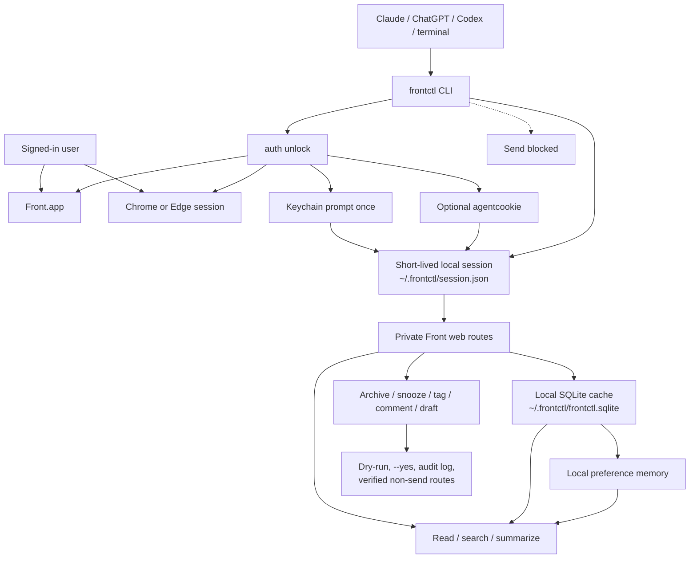

# frontctl

`frontctl` is a local CLI for managing Front mail from the signed-in desktop app or browser session.

It exists because Front's public API is mainly useful for team inbox automation. It does not give a
normal local user the same kind of control over a personal Front inbox that they expect from Gmail,
Apple Mail, or a browser. `frontctl` fills that gap without using the public Front API.

**What it can do**

- Read, search, summarize, and triage Front conversations.
- Archive, unarchive, snooze, unsnooze, tag, and comment on threads.
- Draft replies and discard drafts.
- Learn local triage preferences from recent Front usage.
- Install Codex and Claude skills, plus ChatGPT-ready instructions.

**What it will not do**

- It does not send email.
- It does not print cookies, auth headers, mailbox bodies in diagnostics, or signed attachment URLs.
- It does not use the public Front API.

## Install

For non-technical users, ship the macOS DMG:

1. Open `frontctl-<version>.dmg`.
2. Run `frontctl-<version>.pkg`.
3. Open `Frontctl Setup.app`.
4. Click `Check Setup`, `Install Agent Skills`, then `Enable Live Mode`.

For local development:

```bash
npm install
npm run build
npm link
frontctl doctor --json
frontctl readiness --json
```

For npm users after publication:

```bash
npm install -g frontctl
frontctl setup --agent all --yes --json
```

## Daily Use

Start with read-only commands:

```bash
frontctl inbox list --json
frontctl triage inbox --json
frontctl search "customer name" --json
frontctl read CONVERSATION_ID --format markdown
frontctl summarize CONVERSATION_ID --format plain
```

Unlock live mode once:

```bash
frontctl auth unlock --source default-browser --ttl-hours 12 --json
frontctl auth check --json
```

The unlock command may ask macOS Keychain once. Normal live reads and writes reuse the short-lived
local session cache and should not keep asking for Keychain.

Preview state-changing actions first:

```bash
frontctl archive CONVERSATION_ID --reason "Low-priority thread" --json
frontctl snooze CONVERSATION_ID tomorrow-9am --json
frontctl tag add CONVERSATION_ID TAG_ID_OR_NAME --json
frontctl comment add CONVERSATION_ID --body "Internal note" --json
frontctl draft reply CONVERSATION_ID --body-file reply.md --json
```

Execute only after review:

```bash
frontctl archive CONVERSATION_ID --reason "User approved" --yes --json
```

`frontctl send` is always blocked.

## For Agents

Install local skills:

```bash
frontctl agents install --agent codex --yes --json
frontctl agents install --agent claude --yes --json
frontctl agents prompt --agent chatgpt --json
```

Agents should:

- Prefer read-only commands until the user approves a write.
- Pass `--actor` and `--reason` for any state-changing preview or execution.
- Never add a Front-visible comment just to identify themselves.
- Never send email.

## How It Works



`frontctl` discovers the same private web routes used by the signed-in Front app or browser. For
write operations, it only enables routes that have been verified as non-send actions.

## Browser Verification

When a route changes or needs proof, use a logged-in Chrome or Edge tab:

```bash
frontctl discovery browser-status --remote-debugging-port 9222 --json
frontctl discovery browser-probe CONVERSATION_ID --remote-debugging-port 9222 --target-url-contains conversations/CONVERSATION_ID --json
frontctl discovery verify-browser-writes CONVERSATION_ID --remote-debugging-port 9222 --target-url-contains conversations/CONVERSATION_ID --tag-id TAG_ID --yes --json
```

If the CLI has a valid session but the browser tab is not authenticated:

```bash
frontctl discovery browser-seed --remote-debugging-port 9222 --target-url-contains conversations/CONVERSATION_ID --yes --json
```

This copies the short-lived `frontctl` session into the selected browser tab through CDP without
printing cookie values or touching Keychain.

## Build And Release

Normal checks:

```bash
npm test
```

Local package and DMG validation:

```bash
npm run check:package:local
```

That command runs tests, builds the setup app, builds the `.pkg` and `.dmg`, expands the package,
mounts the DMG, verifies the packaged CLI runs, and checks manifest hashes.

Optional pre-push hook:

```bash
npm run hooks:install
```

The hook runs `npm test` before push. It intentionally does not build the package or DMG on every
commit.

## More Docs

- [Implementation plan](docs/implementation-plan.md)
- [Onboarding](docs/onboarding.md)
- [Distribution](docs/distribution.md)
- [Product and packaging](docs/product-packaging.md)
- [Release checklist](docs/release-checklist.md)
- [Signing and notarization](docs/signing-notarization-setup.md)
