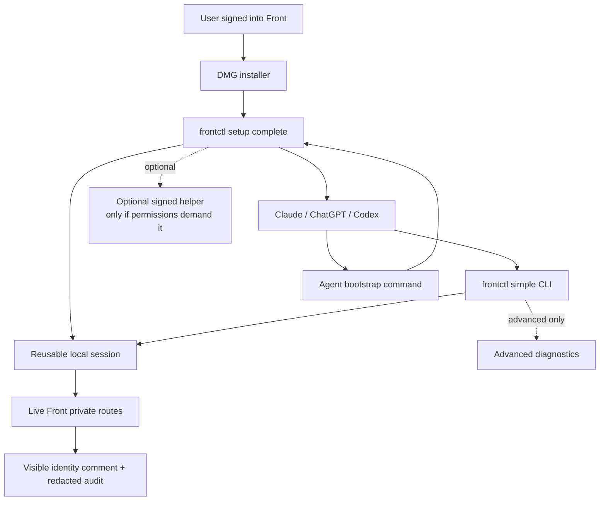

# Simplification Plan

This plan is about making `frontctl` feel obvious for ordinary users and easy for local agents to
install on their behalf. The goal is not fewer capabilities. The goal is fewer product concepts in
the happy path, fewer auth branches in normal use, and a setup experience that either works or gives
one plain next action.

## Product Bar

A non-technical user should be able to:

1. Ask Codex, Claude, or ChatGPT with local command access to install `frontctl`.
2. Let the agent read the repo README and run one bootstrap command.
3. Let the agent open the one permission prompt that may be needed.
4. Approve Touch ID/password once.
5. Let the agent install skills and verify live Front access with a disposable test thread.
6. Ask the agent to read their Front inbox live.
7. Approve an action and see a visible `frontctl agent action` trail in Front.

A user installing manually should still be able to:

1. Download one DMG.
2. Run one installer.
3. Run one setup command.
4. Approve at most one system prompt.
5. Paste one agent prompt.

If that path fails, the app should say exactly one of:

- Install Front or sign into Front in Chrome/Edge.
- Run the printed unlock command once and approve Touch ID/password.
- Install agent skills.
- Send the redacted support bundle.

No normal user or installing agent should have to understand CDP, Keychain Safe Storage, stale
cache, route fixtures, Apple Events, browser profiles, or Front private route discovery.

The installer should front-load any permission prompt. If macOS needs Touch ID/password to read the
existing Front/Chrome/Edge Safe Storage item, the bootstrap should intentionally trigger that prompt
once during setup, verify the reusable `~/.frontctl/session.json` cache, and then prove that
`frontctl auth check`, `frontctl readiness`, and live reads do not prompt again.

## Current State

What works:

- The CLI can read and mutate Front through the local signed-in session.
- Auth check and readiness are non-prompting.
- A reusable session cache prevents repeated Keychain prompts after unlock.
- Live writes are verified against disposable Front conversations.
- State-changing actions write visible identity comments before mutating.
- Sending is blocked.
- DMG/pkg/setup app packaging exists.
- Codex, Claude, and ChatGPT instructions exist.

What still feels too complex:

- There is no single agent bootstrap entrypoint that says: install, setup, verify, and report.
- The setup app exposes separate buttons for check, skills, unlock, support, and Front launch,
  but a full Mac app is not required for the core product.
- The public command surface is very large: 70 TypeScript files and dozens of subcommands.
- Several paths compete in the mental model: local session, app cookies, browser cookies,
  agentcookie, CDP bridge, Apple Events bridge, cache, sync, discovery fixtures.
- Some advanced commands appear in normal docs and skills, making agents sound like debuggers.
- Release verification checks readiness but does not yet create and verify a disposable thread
  through the installed artifact.

## Target Architecture

Keep the internal pieces, but expose a much smaller product:



The product model should be:

> An agent can read this repo, run one bootstrap command, unlock the user's existing Front session
> once, verify live behavior on a disposable thread, then manage approved non-send Front actions with
> a visible audit trail.

Everything else is implementation detail.

## Phase 1: One Agent Bootstrap

Build a single repo-level bootstrap command that an agent can discover from the README and run from
a fresh checkout:

```bash
script/bootstrap_agent_install.sh
```

That script should:

- Install dependencies if needed.
- Build the CLI.
- Install the current package into the user's home directory.
- Run `frontctl setup complete --yes --json`.
- Run `frontctl readiness --json`.
- Preflight permissions by running the one unlock command when no reusable live session exists.
- Explain the prompt before it appears: "macOS may ask for Touch ID/password once so frontctl can
  reuse your existing Front sign-in. Normal reads should not ask again."
- Verify after unlock that `auth.promptsOnCheck` and `auth.promptsOnLiveRead` are false.
- If live access is ready, create a disposable test thread and run `verify-live-writes`.
- Print one short success/failure summary plus the exact agent prompt to use next.
- Avoid sudo by default.
- Avoid writing shell profile files unless explicitly approved.

Under that script, build a single `frontctl setup complete --yes --json` command and make it the
primary product surface. The setup app can become optional, or be removed from the default flow,
unless a signed native wrapper is needed to improve macOS permission prompts.

Responsibilities:

- Run readiness.
- If Front is missing, stop with `front-not-installed`.
- If sign-in is missing, stop with `front-sign-in-missing`.
- If live session is missing:
  - Prefer existing valid session.
  - Prefer agentcookie if present.
  - Otherwise run one explicit default-browser unlock.
  - Never loop unlock attempts.
- Install Codex/Claude skills.
- Return one user-facing state and one next action.

Delete or hide from the normal setup path:

- `setup --enable-live`
- manual bridge setup from consumer onboarding
- Apple Events guidance from default UI
- separate "Check Setup" then "Install Agent Skills" then "Unlock Live Session" sequence

The default install should print:

```bash
script/bootstrap_agent_install.sh
frontctl setup complete --yes
frontctl agents prompt --agent chatgpt
```

If Setup.app remains, it should be a wrapper over the same command, not a separate product:

- One primary button: `Make Frontctl Work`.
- One secondary button: `Open Front`.
- One secondary button: `Support Bundle`.
- An advanced disclosure for raw command output.

If it does not reduce permission friction, remove it from the main DMG instructions and keep it as
an optional support tool.

README should make the agent path first:

```bash
git clone https://github.com/arjshiv/frontctl.git
cd frontctl
script/bootstrap_agent_install.sh
```

The manual DMG path can come second.

## Bootstrap Contract

`script/bootstrap_agent_install.sh` should be safe for an agent to run without extra context.

Inputs:

- Optional `--skip-live-proof` for environments where the user does not want test Front mutations.
- Optional `--no-permission-preflight` for users who want setup without unlocking yet.
- Optional `--agent codex|claude|all`, default `all`.

Required behavior:

1. Detect whether the repo is already built; run `npm install` and `npm run build` when needed.
2. Install to `~/.local/share/frontctl` and write `~/.local/bin/frontctl`.
3. Run `frontctl doctor --json`.
4. Run `frontctl auth check --json`.
5. If auth is invalid, run the recommended one-time unlock from `frontctl readiness --json`.
6. Run `frontctl setup --agent all --yes --json`.
7. Run `frontctl readiness --json` again.
8. If ready and live proof is enabled, create a disposable Front test conversation and run
   `frontctl discovery verify-live-writes`.
9. Print:
   - installed binary path
   - readiness state
   - whether any permission prompt was triggered
   - whether future checks/live reads should prompt
   - live proof result
   - next agent prompt

Failure behavior:

- If Front is not installed or not signed in, stop and tell the agent to ask the user to open/sign
  into Front, then rerun the same bootstrap command.
- If unlock fails, stop and print the exact command the agent should ask the user to approve.
- If live proof fails, generate a redacted support bundle and point to it.
- Never fall back to stale cache for a current inbox proof.
- Never print cookies, auth headers, raw mailbox bodies, or raw private payloads.

The installer is considered successful only when the agent can immediately run:

```bash
frontctl auth check --json
frontctl readiness --json
frontctl inbox list --limit 5 --json
```

without triggering another Keychain prompt.

## Phase 2: Shrink The Agent Surface

Create a "simple mode" command set and make installed skills point there first. This is not feature
removal. It is progressive disclosure: the common path is small, while advanced capabilities remain
available for agents and maintainers when needed.

Recommended simple commands:

```bash
frontctl ready --json
frontctl inbox --limit 20 --json
frontctl read CONVERSATION_ID --json
frontctl act archive CONVERSATION_ID --actor Codex --reason "..." --json
frontctl act archive CONVERSATION_ID --actor Codex --reason "..." --yes --json
frontctl draft reply CONVERSATION_ID --body-file reply.md --json
```

Implementation can route these aliases to existing commands. The purpose is to stop teaching agents
the full internal tree for normal use.

Move these to advanced/debug docs only:

- `discovery *`
- `bridge *`
- `browser *`
- `cache *`
- `sync --offline-cache`
- `mq *`
- `cookies inspect`
- `asar inspect`

The existing commands remain available for maintainers, power users, and troubleshooting agents.
README, onboarding, Setup.app, and installed skills should show the simple path first and link to
advanced docs instead of removing capabilities.

## Phase 3: Make Live Proof A Release Gate

Release verification should prove the installed artifact, not only source code.

Add an installed-binary gate:

```bash
frontctl create-test-conversation --subject "frontctl release verification" --body "Disposable release test" --actor Frontctl --reason "Release verification" --yes --json
frontctl discovery verify-live-writes CONVERSATION_ID --actor Frontctl --yes --json
frontctl audit list --conversation CONVERSATION_ID --json
```

Then assert:

- `source` is `live-private`.
- `publicApiUsed` is false.
- `sendsEmail` is false.
- all route contracts are verified.
- final state is archived.
- no reminder, draft, temporary link, or temporary tag marker remains.
- recent audit contains identity-commented phases before state-changing actions.

This should be optional in CI, but mandatory before giving a build to a human tester on a signed-in
Front machine.

## Phase 4: Reduce Complexity Without Losing Features

Do not rewrite in Go or Bun yet. The bottleneck is product-path complexity, not runtime speed.

Refactor targets:

- Merge `browserBridge` and `cdpBridge` behind one `LiveSessionProbe` interface.
- Keep Apple Events as a separate advanced fallback module if it is still useful for edge cases;
  do not expose it in the normal setup flow.
- Collapse `setup`, `readiness`, and setup-app summarization around one shared readiness schema.
- Move discovery/browser-write/live-write verifier commands under an explicit `frontctl debug`
  namespace, with compatibility aliases for now.
- Split `src/commands/mutations.ts` into action groups only if it reduces duplication; otherwise
  first extract shared preview/execute/identity-comment mechanics.
- Remove duplicate resource aliases from normal help output while keeping backwards compatibility.

Success looks like:

- Normal help output fits on one screen.
- Advanced help is explicit: `frontctl debug help`.
- Setup.app never suggests cache or discovery for ordinary failures.
- Agent skills fit the common flow in under 100 lines each.
- The main CLI command tree has a small public section and a clearly labeled advanced section.
- Existing advanced commands still work, or have compatibility aliases and migration notes.

## Phase 5: Package For A Stranger

Before calling this non-technical-user ready:

- Ship a signed and notarized DMG.
- Use the no-admin user install as the default.
- Make repo-based agent install work from a fresh checkout with one bootstrap script.
- Make the installer and `START HERE.txt` the first visible items in the DMG.
- Make `START HERE.txt` say only:
  1. Run installer.
  2. Run `frontctl setup complete --yes`.
  3. Paste the prompt.
- Add an uninstall path that removes frontctl but never touches Front.app or the user's Front
  account.
- Test on a clean macOS account with Front signed in and with Front not installed.

Only keep a Mac app in the default package if it does one of these better than the CLI:

- obtains or explains a required macOS permission more cleanly
- avoids scary terminal output for failed setup
- creates a support bundle without asking the user to touch the shell

Otherwise, the app is unnecessary surface area.

## What Not To Do

- Do not add more mailbox actions until setup is boring.
- Do not make browser/CDP concepts visible in the default user journey.
- Do not make agents recover from setup by trying random auth commands.
- Do not answer current inbox questions from stale cache.
- Do not ask users to paste cookies, HAR files, or tokens.
- Do not make every command faster by changing runtimes while the UX is still confusing.
- Do not delete proven capabilities just to reduce line count. Hide, group, refactor, or alias them
  unless a feature is unsafe, unverified, or unused.

## Definition Of Done

This simplification pass is done when a new tester can tell an agent:

> Read the `frontctl` repo and install it on this Mac.

The agent should then run one documented bootstrap script, verify live Front access, and have future
agents run:

```bash
frontctl ready --json
frontctl inbox --limit 20 --json
```

without extra instructions, repeated Keychain prompts, public API use, stale cache fallback, or
manual settings changes.
